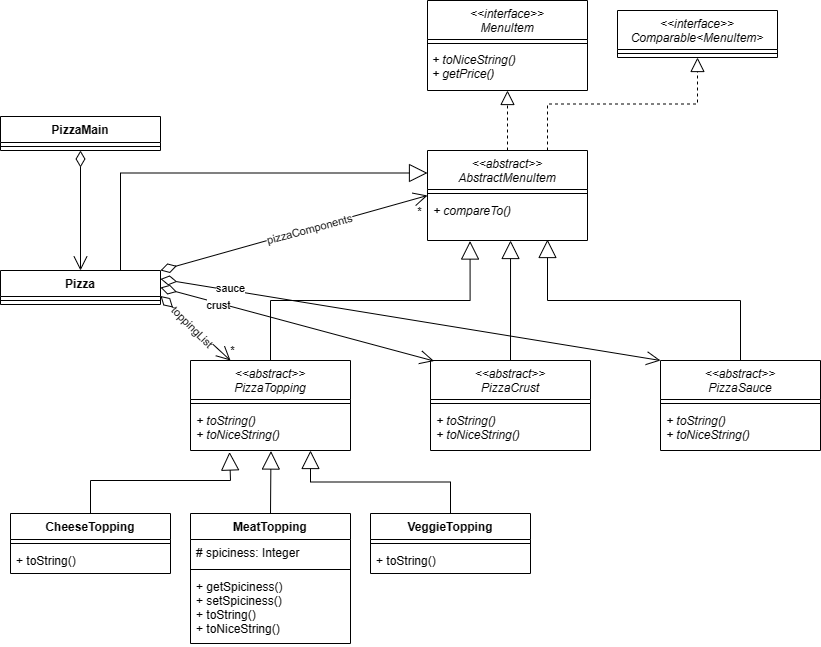

# Pizza & Burger App User Manual

Welcome to the Pizza & Burger app! This user manual will guide you through using the application to create your customized pizzas and burgers.

## Tab Navigation:

The app is divided into multiple tabs, each dedicated to a different aspect of building your pizza or burger. You can switch between tabs by clicking on their names. Here's what each tab offers:

- **Pizza Options:** Explore available crusts, sauces, and toppings for pizzas.
- **Burger Options:** Discover bun types, patties, cheeses, and garnishes for burgers.

## Customize Your Pizza:

1. **Get Started:** Click on the "Pizza" tab to begin customizing your pizza.
2. **Select Components:** Choose your preferred crust, sauce, and toppings from the available options.
3. **Add to Order:** Click the "Add Pizza" button to include your customized pizza in the order list.
4. **Reset Choices:** Use the "Reset" button to clear your selections and start over if needed.
5. **Repeat:** Feel free to add multiple pizzas with different combinations.

## Customize Your Burger:

1. **Switch to Burger Builder:** Navigate to the "Burger" tab to customize your burger.
2. **Customize Components:** Select your desired bun, patty, cheese, and garnishes from the provided choices.
3. **Add to Order:** Click the "Add Burger" button to add your customized burger to the order list.
4. **Reset Selections:** Use the "Reset" button to clear your choices and begin anew.
5. **Add More Burgers:** Create additional burgers with unique configurations as desired.

## Viewing Orders and Receipt:

- **Order Summary:** The "Your Orders" section displays a summary of your current order, listing all added pizzas and burgers.
- **Generate Receipt:** Click on the "Get Receipt" button to generate a detailed receipt showing the total cost of your order.

## Visual Demo Guide:

https://github.com/unocsci2830/csci2830sp24pa2-fritz-03/assets/59139591/750c3733-f804-4f66-a287-779100bc17a9

  
Click to expand

  
  ## Programming Assignment 2 starter code 

This starter project mainly consists of the instructor solution to Exercise 7. Feel free to use it or use your own Exercise 7 as a starting point.

The following UML class diagram shows the corresponding structure of this code:

(For readability, subclasses of PizzaCrust, PizzaSauce, and the indirect subclasses of PizzaTopping are not shown.)

